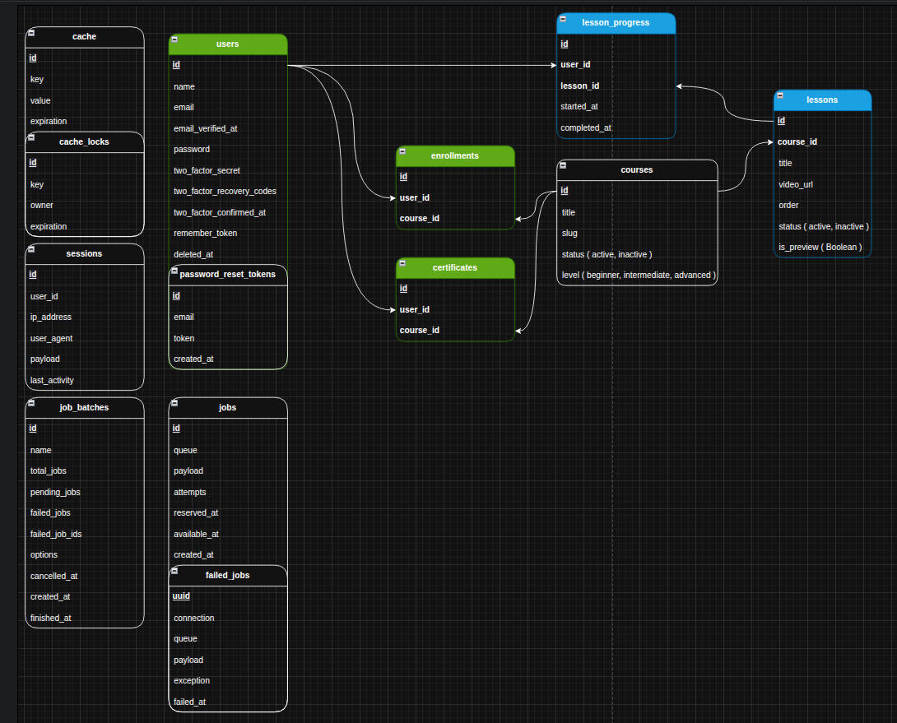

# Database Entity Relationship Diagram

Visual representation of the mini-lms database schema and relationships.

---

## 📊 ERD Overview

The Entity Relationship Diagram (ERD) provides a visual blueprint of the database structure, showing all tables, relationships, and constraints in the mini-lms system.

### Image Reference
- **File**: `img.png`
- **Format**: PNG
- **Tool**: Draw.io (`erd-db.drawio`)
- **Last Updated**: [Update when modified]

### Database ERD


---

## 🗄️ Schema Entities

### Core Tables

| Table | Primary Key | Key Features | Relationships                                  |
|-------|-------------|--------------|------------------------------------------------|
| **users** | `id` | Authentication, profile | 1:N → enrollments, certificates, lesson_progress |
| **courses** | `id` | Unique slug, status/level enums | 1:N → lessons, enrollments, certificates       |
| **lessons** | `id` | Order, preview flag, content | N:1 → courses                                  |
| **enrollments** | `id` | Composite unique (user,course) | N:1 → users, courses                           |
| **certificates** | `uuid` | UUID primary key, PDF generation | N:1 → users, courses                           |
| **lesson_progress** | `id` | Completion timestamps | N:1 → users, lessons                           |

---

## 🔗 Relationship Types

### One-to-Many (1:N)
- **User → Enrollments**: A user can enroll in multiple courses
- **User → Certificates**: A user can earn multiple certificates
- **User → LessonProgress**: A user tracks progress across multiple lessons
- **Course → Lessons**: A course contains multiple ordered lessons
- **Course → Enrollments**: Multiple users can enroll in one course
- **Course → Certificates**: Multiple certificates issued for one course
- **Lesson → LessonProgress**: Multiple users track progress for one lesson

### Many-to-Many (N:M)
- **Users ↔ Courses**: Implemented through `enrollments` join table

---

## 🛡️ Constraints & Business Rules

### Database Constraints
- `courses.slug` — UNIQUE index for SEO-friendly URLs
- `enrollments(user_id, course_id)` — COMPOSITE UNIQUE prevents duplicate enrollments
- `lessons.course_id` — FOREIGN KEY with CASCADE DELETE
- `certificates.uuid` — UNIQUE UUID primary key

### Soft Deletes Applied
- ✅ `courses` — Preserves enrollment history
- ✅ `lessons` — Maintains course structure
- ✅ `enrollments` — Retains user activity
- ✅ `lesson_progress` — Keeps learning analytics

---

## 📈 Data Flow Patterns

### Enrollment Flow
```
User → Course → Enrollment → Certificate
      ↓
   Lessons → LessonProgress
```

### Learning Progress Flow
```
User → Lesson → LessonProgress → Course Completion
```

---

## 🔧 ERD Maintenance

### Updating the Diagram
1. Open `erd-db.drawio` in Draw.io
2. Modify schema changes
3. Export as PNG to `img.png`
4. Update this documentation

### Version Control
- `erd-db.drawio` — Source diagram file
- `img.png` — Generated image (committed)
- `.$erd-db.drawio.bkp` — Automatic backup

---

## 📋 Schema Validation Rules

### Enum Types
- **StatusEnum**: `active`, `inactive`
- **CourseLevelEnum**: `beginner`, `intermediate`, `advanced`

### Timestamp Patterns
- `created_at`, `updated_at` — Standard Laravel timestamps
- `started_at`, `completed_at` — Lesson progress tracking
- `created_at == (issued_at)` — Certificate generation timestamp

---

## 🚀 Performance Considerations

### Indexed Columns
- Primary keys (all tables)
- `courses.slug` — URL lookups
- `enrollments(user_id, course_id)` — Enrollment checks
- Foreign keys — Join optimization

### Query Patterns
- User enrollments: `WHERE user_id = ?`
- Course lessons: `WHERE course_id = ? ORDER BY order`
- Progress tracking: `WHERE user_id = ? AND lesson_id = ?`

---

*This ERD reflects the current database schema as implemented in the migrations. For the most up-to-date structure, refer to the migration files in `database/migrations/`.*
